# 📋 React Native Mobile App Build Validation Report

**Generated on:** 2025-08-02  
**Project:** FieldSync Mobile App  
**Version:** 1.0.0  

## 🎯 Validation Summary

| Category | Status | Issues |
|----------|--------|--------|
| Project Structure | ✅ **PASS** | 0 errors |
| TypeScript Compilation | ❌ **FAIL** | 303 errors |
| ESLint Validation | ❌ **FAIL** | 1 configuration error |
| Build Configuration | ✅ **PASS** | Babel config fixed |
| Dependencies | ⚠️ **WARNING** | 23 outdated packages |

## 📊 Detailed Analysis

### ✅ **Fixed Issues**
1. **Babel Configuration** - Removed invalid plugins causing build failures
2. **Project Structure** - Created missing `src/App.tsx` and `src/services/` directory
3. **Build Scripts** - Added comprehensive build validation scripts

### ❌ **Critical Issues (Must Fix for Release)**

#### 1. TypeScript Compilation Errors (303 total)
**Root Cause:** Missing UI component module declarations

**Affected Files:**
- 19 onboarding screen files
- All screens importing from `@components/ui/*`

**Error Categories:**
- **Module not found errors:** 57 instances (UI component imports)
- **Implicit 'any' types:** 150+ instances (function parameters)
- **Style array type mismatches:** 25+ instances
- **Navigation import errors:** 1 instance (@react-navigation/stack)

#### 2. ESLint Configuration Error
**Issue:** `@typescript-eslint/no-unused-expressions` rule configuration conflict
**Impact:** Prevents code quality validation

### ⚠️ **Warnings**
1. **Outdated Dependencies:** 23 packages need updates
2. **Bundle Size Analysis:** Could not complete (dependent on TS compilation)

## 🔧 **Recommended Fix Strategy**

### Phase 1: Core Infrastructure (Priority: HIGH)
1. **Fix UI Component Module Resolution**
   ```bash
   # Install missing UI component dependencies or fix import paths
   npm install react-native-elements react-native-vector-icons
   ```

2. **Update Navigation Dependencies**
   ```bash
   npm install @react-navigation/stack
   ```

3. **Fix ESLint Configuration**
   - Update ESLint rules configuration
   - Resolve TypeScript plugin conflicts

### Phase 2: Code Quality (Priority: MEDIUM)
1. **Add Type Annotations**
   - Fix 150+ implicit 'any' types
   - Add proper TypeScript interfaces

2. **Fix Style Array Types**
   - Ensure proper StyleProp typing
   - Fix conditional style assignments

### Phase 3: Optimization (Priority: LOW)
1. **Update Dependencies**
   - Update 23 outdated packages
   - Test compatibility after updates

2. **Bundle Optimization**
   - Analyze bundle size after compilation fixes
   - Optimize imports and dependencies

## 🚀 **Immediate Action Items**

### For Release Readiness:
1. **Create proper UI component library** or **fix import paths**
2. **Add missing navigation dependency**
3. **Fix ESLint configuration**
4. **Add type annotations to eliminate 'any' types**

### Estimated Time to Fix:
- **Critical Issues:** 4-6 hours
- **Code Quality:** 8-12 hours
- **Total:** 12-18 hours for full build validation

## 📈 **Progress Tracking**

```mermaid
graph LR
    A[Current State] --> B[Fix UI Components]
    B --> C[Fix TypeScript]
    C --> D[Fix ESLint]
    D --> E[Release Ready]
    
    A -.->|"❌ 303 TS errors<br/>❌ ESLint errors<br/>⚠️ 23 outdated deps"| A
    B -.->|"✅ UI components<br/>🔄 Reduced TS errors"| B
    C -.->|"✅ TypeScript clean<br/>🔄 ESLint check"| C
    D -.->|"✅ Code quality<br/>🔄 Final validation"| D
    E -.->|"✅ Production ready<br/>✅ All checks pass"| E
```



## 🎯 **Success Criteria**

**Build validation will pass when:**
- ✅ TypeScript compilation: 0 errors
- ✅ ESLint validation: 0 errors, 0 warnings
- ✅ Unit tests: All passing
- ✅ Bundle creation: Successful for both Android/iOS
- ✅ Dependencies: Up to date and secure

---

**Next Steps:** Address critical TypeScript errors first, then ESLint configuration, followed by dependency updates.
